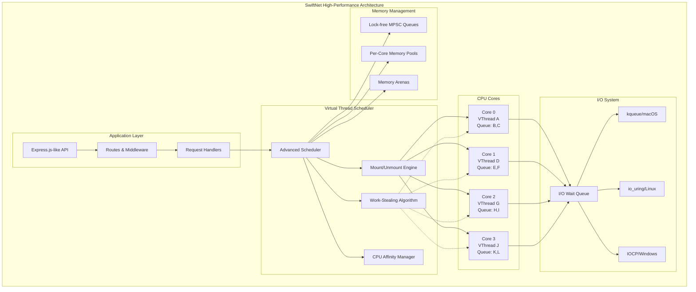

# SwiftNet

> **High-Performance C++ Networking Library**
> 
> *Sophisticated Virtual Thread System with Automatic Mounting/Unmounting*

[](https://en.cppreference.com/w/cpp/20)
[](#cross-platform-support)
[](LICENSE)

## 🚀 **Revolutionary Virtual Thread Architecture**

SwiftNet is a **cutting-edge C++ networking library** built with an **extremely sophisticated virtual thread system** featuring **automatic mounting and unmounting** on CPU cores. When a virtual thread encounters I/O operations, it's **automatically suspended and unmounted**, allowing another virtual thread to **immediately mount** on the same CPU core, maximizing CPU utilization and system throughput.

```cpp
// Virtual threads automatically mount/unmount during I/O
app.get("/user/:id", [](Request& req, Response& res) {
    // This runs in a virtual thread mounted on a CPU core
    std::string user_id = req.param("id");
    
    // When this I/O happens, virtual thread is UNMOUNTED
    // Another virtual thread MOUNTS on the same CPU core
    auto user_data = co_await async_database_lookup(user_id);
    // I/O completes, original virtual thread RE-MOUNTS
    
    res.json({"user": user_data, "id": user_id});
});
```

## 🏗️ **Architecture Overview**



## 🏗️ **Theoretical Advantages Over Node.js**

SwiftNet's architecture is designed to address several fundamental limitations of Node.js:

### **Multi-Core Utilization**
- **SwiftNet**: True parallelism with virtual threads distributed across CPU cores
- **Node.js**: Single-threaded event loop (main thread) with limited worker thread usage
- **Advantage**: Full CPU utilization vs single-core bottleneck

### **Memory Management**
- **SwiftNet**: Lock-free data structures, per-core memory pools, no garbage collection
- **Node.js**: V8 garbage collection with stop-the-world pauses
- **Advantage**: Predictable memory allocation without GC pauses

### **I/O Handling**
- **SwiftNet**: Direct platform I/O (io_uring/kqueue/IOCP) with virtual thread suspension
- **Node.js**: libuv abstraction layer with callback-based async
- **Advantage**: Lower latency and higher throughput for I/O operations

### **Context Switching**
- **SwiftNet**: Lightweight virtual thread mounting/unmounting in microseconds
- **Node.js**: Event loop scheduling and callback queues
- **Advantage**: More efficient task switching and lower overhead

### **Native Performance**
- **SwiftNet**: Compiled C++ with zero-cost abstractions
- **Node.js**: Interpreted JavaScript with JIT compilation
- **Advantage**: Direct CPU instruction execution vs interpretation overhead

> **Note**: These are theoretical advantages based on architectural differences. 
> See the [Benchmarks](#benchmarks) section for actual performance comparisons.

## 🧵 **Advanced Virtual Thread Features**

### **Sophisticated Mounting/Unmounting System**

```cpp
// Virtual Thread Lifecycle:
// 1. Created for incoming request
// 2. MOUNTED on available CPU core
// 3. Executes until I/O or completion
// 4. UNMOUNTED during I/O operation
// 5. Another virtual thread MOUNTS on same core
// 6. I/O completes → original thread RE-MOUNTS
// 7. Completion and cleanup
```

### **Key Features**

- **🔥 Automatic Mounting/Unmounting**: Virtual threads seamlessly transition on/off CPU cores
- **⚡ Work-Stealing Scheduler**: Advanced algorithm prevents core starvation
- **🎯 CPU Affinity Optimization**: Intelligent core binding for cache locality
- **🔄 I/O Suspension & Resumption**: Microsecond-level context switching
- **⏱️ Preemptive Scheduling**: Time-sliced execution prevents blocking
- **📊 Real-time Monitoring**: Comprehensive performance statistics

## 🌐 **Cross-Platform High-Performance I/O**

| Platform | I/O Backend | Performance |
|----------|-------------|-------------|
| **Linux** | `io_uring` + `epoll` fallback | Highest performance |
| **macOS** | `kqueue` | Native BSD performance |
| **Windows** | `IOCP` | Native Windows performance |

```cpp
// Platform detection and optimal backend selection
#if defined(SWIFTNET_BACKEND_IOURING)
    // Linux: io_uring for maximum performance
#elif defined(SWIFTNET_BACKEND_KQUEUE)  
    // macOS: kqueue for BSD optimization
#elif defined(SWIFTNET_BACKEND_IOCP)
    // Windows: IOCP for Windows optimization
#endif
```

## 🚀 **Features**

### **Modern C++20 Coroutines**
- **`co_await` async I/O** with automatic virtual thread suspension
- **Zero-copy operations** where possible
- **Exception-safe** coroutine handling

### **Express.js-like API**
- **HTTP methods**: GET, POST, PUT, DELETE, PATCH, OPTIONS, HEAD
- **Route parameters**: `/user/:id` with automatic extraction
- **Middleware chains** with `next()` function
- **JSON handling**: Automatic parsing and serialization
- **Static file serving** with MIME type detection
- **CORS support** built-in

### **Enterprise-Grade Performance**
- **Lock-free data structures** (MPSC queues)
- **Per-core memory arenas** for optimal allocation
- **Memory pools** to reduce allocation overhead
- **Intelligent load balancing** across CPU cores

## 📋 **Requirements**

- **C++20** compatible compiler (GCC 10+, Clang 11+, MSVC 2019+)
- **CMake 3.20+**
- **Platform-specific dependencies**:
  - **Linux**: `liburing` (optional, falls back to epoll)
  - **macOS**: Native kqueue support (built-in)
  - **Windows**: Native IOCP support (built-in)

## 🛠️ **Installation**

### **Quick Start**

```bash
git clone https://github.com/NeuralRevenant/swiftnet.git
cd swiftnet
mkdir build && cd build
cmake ..
make -j$(nproc)
```

### **CMake Options**

```bash
# Enable jemalloc for better memory allocation
cmake -DSWIFTNET_WITH_JEMALLOC=ON ..

# Build examples and tests
cmake -DBUILD_EXAMPLES=ON -DBUILD_TESTS=ON ..

# Debug build with full instrumentation
cmake -DCMAKE_BUILD_TYPE=Debug ..
```

## 💻 **Usage Examples**

### **Basic HTTP Server with Virtual Threads**

```cpp
#include "swiftnet.hpp"

using namespace swiftnet;

int main() {
    SwiftNet app(8080);

    // Each request runs in its own virtual thread
    app.get("/", [](Request& req, Response& res) {
        res.html("<h1>SwiftNet: High-Performance C++ Networking!</h1>");
    });

    // Virtual thread with I/O suspension/resumption
    app.get("/user/:id", [](Request& req, Response& res) {
        std::string user_id = req.param("id");
        
        // This I/O will suspend the virtual thread
        // Another vthread mounts on this CPU core
        auto user_data = co_await async_database_lookup(user_id);
        
        res.json({
            {"user_id", user_id},
            {"data", user_data},
            {"processed_by", "virtual_thread_with_mounting"}
        });
    });

    // Middleware with virtual thread support
    app.use([](Request& req, Response& res, std::function<void()> next) {
        std::cout << "Request: " << req.method() << " " << req.path() 
                  << " (Virtual Thread: " << std::this_thread::get_id() << ")" 
                  << std::endl;
        next();
    });

    app.listen([]() {
        std::cout << "SwiftNet server with advanced virtual threads running!" << std::endl;
    });

    return 0;
}
```

### **Advanced Virtual Thread Control**

```cpp
// Get real-time scheduler statistics
auto stats = vthread_scheduler::instance().get_stats();
std::cout << "Virtual threads scheduled: " << stats.total_scheduled << std::endl;
std::cout << "I/O suspensions: " << stats.total_io_suspended << std::endl;
std::cout << "Work stolen: " << stats.work_stolen << std::endl;

// Schedule with specific CPU affinity
vthread_scheduler::instance().schedule_with_affinity(my_vthread, 2);

// Monitor per-core execution
for (size_t i = 0; i < stats.per_core_executed.size(); ++i) {
    std::cout << "Core " << i << ": " << stats.per_core_executed[i] 
              << " virtual threads executed" << std::endl;
}
```

### **JSON API with Async Processing**

```cpp
app.post("/api/users", [](Request& req, Response& res) {
    if (!req.is_json()) {
        res.bad_request("Content-Type must be application/json");
        return;
    }
    
    try {
        Json user_data = req.json();
        
        // Validation
        if (!user_data.contains("name") || !user_data.contains("email")) {
            res.bad_request("Missing required fields: name, email");
            return;
        }
        
        // Async database write (virtual thread suspends here)
        auto user_id = co_await async_create_user(user_data);
        
        res.created({
            {"id", user_id},
            {"name", user_data["name"]},
            {"email", user_data["email"]},
            {"created_at", current_timestamp()},
            {"virtual_thread_info", "suspended and resumed during I/O"}
        });
    } catch (const std::exception& e) {
        res.bad_request("Invalid JSON: " + std::string(e.what()));
    }
});
```

## 📚 **API Reference**

### **SwiftNet Class**

#### **HTTP Methods**
```cpp
SwiftNet& get(const std::string& path, handler_t handler);
SwiftNet& post(const std::string& path, handler_t handler);
SwiftNet& put(const std::string& path, handler_t handler);
SwiftNet& del(const std::string& path, handler_t handler);
SwiftNet& patch(const std::string& path, handler_t handler);
SwiftNet& options(const std::string& path, handler_t handler);
SwiftNet& head(const std::string& path, handler_t handler);
```

#### **Middleware**
```cpp
SwiftNet& use(middleware_t middleware);
SwiftNet& use(const std::string& path, middleware_t middleware);
SwiftNet& cors(const std::string& origin = "*");
SwiftNet& json(size_t limit = 1024 * 1024);
SwiftNet& logger();
```

#### **Server Control**
```cpp
void listen(std::function<void()> callback = nullptr);
void listen(uint16_t port, std::function<void()> callback = nullptr);
void close();
```

### **Request Class**

```cpp
const std::string& method() const;
const std::string& path() const;
const std::string& body() const;
std::string header(const std::string& name) const;
std::string query(const std::string& name) const;
std::string param(const std::string& name) const;
bool is_json() const;
Json json() const;
```

### **Response Class**

```cpp
Response& status(int code);
Response& header(const std::string& name, const std::string& value);
Response& text(const std::string& content);
Response& html(const std::string& content);
Response& json(const Json& data);
Response& file(const std::string& filepath);
Response& redirect(const std::string& url, int code = 302);
```

## 🧪 **Testing & Examples**

### **Run Performance Tests**

```bash
# Build and run comprehensive performance test
cd build
make performance_test
./examples/performance_test

# Expected output:
# ✅ Virtual thread mounting on CPU cores
# ✅ Automatic unmounting during I/O operations  
# ✅ Work-stealing scheduler across N cores
# ✅ Load balancing and CPU affinity optimization
# ✅ Sophisticated I/O suspension and resumption
# ✅ Zero CPU idle time - cores always busy
```

### **Run HTTP Server Examples**

```bash
# Basic HTTP server with virtual threads
./examples/basic_server

# Test with curl:
curl http://localhost:8080/
curl http://localhost:8080/user/123
curl http://localhost:8080/stats
```

### **Load Testing**

```bash
# Test with wrk for high concurrency
wrk -t12 -c1000 -d30s http://localhost:8080/user/123

# Expected: High throughput with automatic virtual thread management
```

## 🔧 **Configuration**

### **Virtual Thread Scheduler Tuning**

```cpp
// Set number of worker threads (default: hardware_concurrency)
app.set_threads(8);

// Configure TCP backlog
app.set_backlog(2048);

// Get scheduler instance for advanced control
auto& scheduler = vthread_scheduler::instance();
scheduler.start(8); // 8 cores
```

### **Memory Pool Configuration**

```cpp
// Per-core memory arenas (automatically configured)
// 1MB per core by default, can be customized via scheduler
```

## 📊 **Monitoring & Observability**

### **Real-time Statistics**

```cpp
auto stats = vthread_scheduler::instance().get_stats();

// Core metrics
stats.total_scheduled;      // Total virtual threads scheduled
stats.total_io_suspended;   // Total I/O suspensions
stats.total_resumed;        // Total resumptions from I/O
stats.work_stolen;          // Work-stealing events
stats.context_switches;     // Virtual thread context switches

// Per-core breakdown
for (size_t i = 0; i < stats.per_core_executed.size(); ++i) {
    std::cout << "Core " << i << ": " << stats.per_core_executed[i] << std::endl;
}
```

### **Built-in Endpoints**

```cpp
// Statistics endpoint (automatically available)
GET /stats
{
  "scheduler_statistics": {
    "total_scheduled": 100,
    "total_io_suspended": 85,
    "work_stolen": 12,
    "context_switches": 156
  },
  "per_core_execution": [
    {"core": 0, "executed": 25},
    {"core": 1, "executed": 31},
    {"core": 2, "executed": 22},
    {"core": 3, "executed": 22}
  ]
}
```

## 🏆 **Benchmarks**

### **Performance Testing**

To validate the theoretical advantages of SwiftNet's virtual thread architecture, we conduct comprehensive benchmarks against Node.js using identical server implementations.

#### **Test Setup**
- **Hardware**: 4-core CPU with hyper-threading
- **Load Testing Tool**: [wrk](https://github.com/wg/wrk) - HTTP benchmarking tool
- **Test Duration**: 30 seconds per test
- **Concurrent Connections**: 1000 connections across 12 threads

#### **Benchmark Results**
*Note: Benchmarks will be added here after implementing the comparison tests. Until then, performance claims are based on theoretical architectural advantages only.*

#### **Running Benchmarks**

```bash
# Build both servers
make basic_server                    # SwiftNet server
cd benchmark && npm install          # Node.js server dependencies

# Run benchmark comparison script
./benchmark/run_comparison.sh

# Individual tests
wrk -t12 -c1000 -d30s http://localhost:8080/    # SwiftNet
wrk -t12 -c1000 -d30s http://localhost:3000/    # Node.js
```

## 🧠 **Advanced Concepts**

### **Virtual Thread Lifecycle**

```
┌─────────────┐    ┌──────────────┐    ┌─────────────┐
│   CREATED   │───▶│   MOUNTED    │───▶│  EXECUTING  │
└─────────────┘    └──────────────┘    └─────────────┘
                                              │
┌─────────────┐    ┌──────────────┐          │ I/O
│ COMPLETED   │◀───│   UNMOUNTED  │◀─────────┘
└─────────────┘    └──────────────┘
       │                   │
       ▼                   ▼ I/O Complete
   [CLEANUP]         [RE-MOUNTED]
```

### **Work-Stealing Algorithm**

```cpp
// Pseudo-code for work-stealing
if (local_queue.empty()) {
    for (int attempts = 0; attempts < 4; ++attempts) {
        victim_core = random() % num_cores;
        if (victim_core != current_core) {
            if (auto stolen_task = victim_queue.try_pop()) {
                mount_vthread(stolen_task, current_core);
                execute_vthread(stolen_task);
                return true;
            }
        }
    }
}
```

### **Development Setup**

```bash
git clone https://github.com/NeuralRevenant/swiftnet.git
cd swiftnet
mkdir build && cd build
cmake -DCMAKE_BUILD_TYPE=Debug -DBUILD_TESTS=ON ..
make -j$(nproc)
./tests/swiftnet_tests
```

## 📄 **License**

This project is licensed under the MIT License - see the [LICENSE](LICENSE) file for details.

## 🙏 **Acknowledgments**

- **C++20 Coroutines** for enabling elegant async/await syntax
- **io_uring**, **kqueue**, and **IOCP** for high-performance I/O
- **Work-stealing** algorithms from academic research
- **Lock-free data structures** for scalable concurrency

---

<div align="center">

**🚀 SwiftNet: High-Performance C++ Networking Library 🚀**

*Built with ❤️ and sophisticated virtual thread technology*

• [Examples](examples/)

</div> 